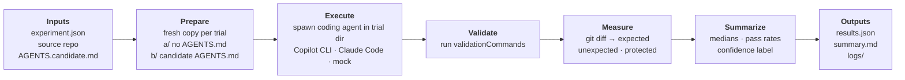

# AGENTS.md Benchmark Plugin

A portable Agent Plugin for measuring whether `AGENTS.md` changes coding-agent behavior in a repository.

This plugin helps maintainers run controlled before/after experiments: one condition without `AGENTS.md`, one condition with a candidate `AGENTS.md`, both using the same task prompt and starting state. The goal is to collect evidence about agent behavior instead of assuming repo instructions help.

It includes both a portable agent skill and a dependency-free Node.js runner for repeated, machine-readable trials.

## What this plugin does

- Inspects a repository for build commands, test commands, conventions, generated files, and protected files.
- Helps draft a short, concrete candidate `AGENTS.md`.
- Designs benchmark tasks that test scoped edits, multi-file changes, and messy cross-surface work.
- Guides creation of local baseline and treatment repo copies.
- Compares agent behavior across conditions.
- Produces a private report with files changed, diff size, validation commands, scope creep, and protected-file touches.
- Creates fresh condition copies for every run and launches the configured agent as a separate process.
- Writes structured JSON results, trial logs, and a Markdown summary with medians and confidence labels.

The plugin reports neutral and inconclusive results honestly. It should not claim `AGENTS.md` helped when both conditions behaved the same.

## Why this exists

`AGENTS.md` is useful only if it changes what agents do in practice. Simple tasks may not show a difference because the right change is obvious. Messier tasks are more revealing: they can show whether repo instructions reduce wandering, over-editing, unnecessary commands, or edits to protected surfaces.

This plugin turns that measurement workflow into a reusable skill.

## Architecture

The skill layer does the thinking (inspect the repo, draft the candidate, design tasks, interpret results). The runner does the measuring. For every task, run, and condition it makes a fresh copy of the source repo, spawns the configured agent as a separate process, and turns the resulting Git diff into metrics.



The Prepare → Measure loop repeats for each task × run × condition. `a/` is the baseline (no `AGENTS.md`), `b/` is the treatment (candidate `AGENTS.md`). Everything lands under `experiment-runs/<name>/`.

## Package layout

```text
agents-md-benchmark-plugin/
|-- bin/
|   `-- agents-md-benchmark.mjs
|-- examples/
|   `-- fixture-experiment.json
|-- fixtures/
|   `-- runtime-guardrail/
|-- schemas/
|   |-- experiment.schema.json
|   `-- results.schema.json
|-- plugin.json
|-- package.json
|-- skills/
|   `-- agents-md-benchmark/
|       |-- SKILL.md
|       `-- references/
|           |-- AGENTS.template.md
|           |-- benchmark-prompts.md
|           |-- failure-modes.md
|           |-- quick-start-checklist.md
|           |-- report-template.md
|           |-- sanitized-summary.md
|           `-- task-design-guide.md
|-- LICENSE
`-- README.md
```

## Install

Clone the repository:

```bash
git clone https://github.com/AndreaGriffiths11/agents-md-benchmark-plugin.git
```

Then point your Agent Plugins-compatible client at the clone, or copy `skills/agents-md-benchmark/` into the directory your client reads skills from. The skill is a directory of Markdown files with no build step and no dependencies.

The optional runner requires Node.js 20 or newer and Git.

## Five-minute runner demo

Run the deterministic fixture:

```bash
npm run benchmark:fixture
```

The fixture uses a tiny local mock agent to prove the harness itself:

- Baseline adds inline styles and fails the CSP validation.
- Treatment reads `AGENTS.md`, uses CSS classes, and passes.
- Results are written to `experiment-runs/fixture/results.json`.
- A readable comparison is written to `experiment-runs/fixture/summary.md`.

The mock fixture validates the runner, not the performance of a real coding agent. To run a real experiment, copy `examples/fixture-experiment.json`, replace its source, candidate, task, and agent command, then run:

```bash
node ./bin/agents-md-benchmark.mjs validate ./path/to/experiment.json
node ./bin/agents-md-benchmark.mjs plan ./path/to/experiment.json
node ./bin/agents-md-benchmark.mjs run ./path/to/experiment.json
```

See [`docs/runner.md`](docs/runner.md) for the manifest contract and [`docs/client-adapters.md`](docs/client-adapters.md) for agent integration.

## Using the skill

Load this plugin in an Agent Plugins-compatible client, then ask for the `agents-md-benchmark` skill when you want to test `AGENTS.md` impact.

Example request:

```text
Use the agents-md-benchmark skill to design a private before/after experiment for this repository.
```

The skill will guide the agent to:

1. Inspect the repo.
2. Draft or refine a candidate `AGENTS.md`.
3. Design benchmark prompts.
4. Create local baseline and treatment copies.
5. Run matching agent trials.
6. Compare results.
7. Produce a private report.

## References included

| File | Purpose |
|---|---|
| `skills/agents-md-benchmark/SKILL.md` | Main portable skill instructions |
| `skills/agents-md-benchmark/references/AGENTS.template.md` | Starter `AGENTS.md` template |
| `skills/agents-md-benchmark/references/benchmark-prompts.md` | Prompt patterns for benchmark tasks |
| `skills/agents-md-benchmark/references/task-design-guide.md` | Concrete patterns and examples for designing messy tasks |
| `skills/agents-md-benchmark/references/quick-start-checklist.md` | Printable checklist to track progress through the workflow |
| `skills/agents-md-benchmark/references/failure-modes.md` | Diagnosis and recovery steps for common benchmarking problems |
| `skills/agents-md-benchmark/references/report-template.md` | Report structure for private/internal results |
| `skills/agents-md-benchmark/references/sanitized-summary.md` | Public-safe example summary pattern |
| `skills/agents-md-benchmark/references/case-studies.md` | Positive, neutral, and negative sanitized result patterns |

## Runner safeguards

- Git sources must be clean unless `sourceMode` is explicitly set to `directory`.
- Every task/run/condition starts from a new copy and fresh Git repository.
- Trial directories use opaque `a`/`b` slots rather than condition names.
- The child process receives the task prompt and working directory, not benchmark framing or the other condition.
- The runner never pushes, publishes, or modifies the source repository.
- Configured agent and validation commands execute locally with the current user's permissions; review manifests before running them.

## Example data

The included examples are intentionally generic. They show the shape of a benchmark report without using real repository names, private paths, raw diffs, or source code.

When you run the skill on your own repo, keep detailed benchmark artifacts local unless you choose to share them. For reusable examples, describe the behavior and metrics without exposing project-specific details.

## More skills

This repository is the shareable Agent Plugin package for the skill.

For more skills by me, visit `mainbranch.dev/skills/`.

## License

MIT
